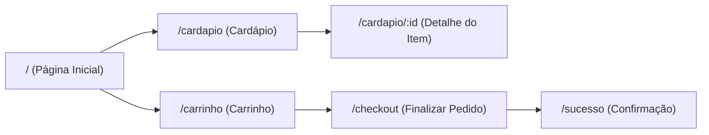

# **Resumo Executivo**  
O **49.5-Food-Delivery** é um aplicativo web de entrega de comidas desenvolvido em **React** (provavelmente na versão 18.x atual【43†L23-L30】). Ele permite que usuários naveguem por um cardápio de restaurantes, adicionem itens ao carrinho e finalizem pedidos online. O projeto utiliza ferramentas padrão do *Create React App* para construção e testes【40†L195-L202】【40†L212-L219】. Este README detalha funcionalidades, dependências, instalação, execução, uso e outros aspectos do projeto.

## **Funcionalidades Principais**  
- **Página Inicial (Home)**: Exibe destaques ou categorias iniciais de itens para entrega.  
- **Cardápio/Lista de Itens**: Interface que lista produtos (e.g. pratos, bebidas) disponíveis para pedido.  
- **Detalhe do Produto**: Ao clicar em um item, abre uma página de detalhes com imagem, descrição e opção de adicionar ao carrinho.  
- **Carrinho de Compras**: Interface onde o usuário pode revisar itens adicionados, alterar quantidades ou remover produtos, com cálculo de preço total.  
- **Checkout (Finalizar Pedido)**: Processo de confirmação do pedido com possíveis campos para endereço, forma de pagamento, etc.  
- **Roteamento e Navegação**: Várias rotas (páginas) interligadas via React Router (por exemplo, `/`, `/cardapio`, `/produto/:id`, `/carrinho`, `/checkout`, etc.).  
- **Design Responsivo**: Layout adaptado para desktop e dispositivos móveis (não detalhado no código fornecido).  

> **Nota:** Detalhes de autenticação (login/registro) ou integração com API externa de backend não estão especificados no repositório (“não especificado”). Presume-se que o front-end faz requisições a algum serviço API para obter itens do menu e submeter pedidos.

## **Pré-requisitos**  
- **Node.js** (versão >= 14.x recomendada)【40†L77-L84】.  
- **npm** (incluído no Node) ou **Yarn** para gerenciar pacotes. O *Create React App* utiliza `npm` ou `yarn` para instalar dependências【40†L141-L150】.  
- **Git** para clonar o repositório.  
- **Serviços externos**: Caso o app consuma APIs (por exemplo, para produtos ou autenticação), certifique-se de ter estas URLs ou chaves de API definidas nas variáveis de ambiente (ver seção de *Variáveis de Ambiente*).  

## **Instalação**  
1. **Clonar o repositório**:  
   ```bash
   git clone https://github.com/Zumbisinho/49.5-Food-Delivery.git
   cd 49.5-Food-Delivery
   ```
2. **Instalar dependências**:  
   Com npm: `npm install`  
   Ou com Yarn: `yarn install`  
3. **Configurar variáveis de ambiente**: Crie um arquivo `.env` na raiz do projeto com as chaves necessárias. Por exemplo:  
   ```bash
   # Exemplo de variáveis (substitua os valores pelos corretos)
   REACT_APP_API_URL=https://api.exemplo.com
   REACT_APP_API_KEY=abcdef123456
   ```
   **Importante:** No *Create React App*, todas as variáveis de ambiente públicas devem começar com `REACT_APP_` para serem reconhecidas【41†L67-L74】. Variáveis sem este prefixo serão ignoradas.

4. **Verificar Node e npm** (opcional): Confira que `node -v` e `npm -v` atendem os requisitos. Node >=14 é recomendado【40†L77-L84】.

## **Scripts Disponíveis**

| Comando            | Descrição                                                    |
|--------------------|--------------------------------------------------------------|
| `npm start`        | Inicia o servidor de desenvolvimento (modo *dev*)【40†L195-L202】. Abre o app em `http://localhost:3000` por padrão. |
| `npm run build`    | Gera os arquivos otimizados para produção na pasta `build`【40†L212-L219】. O aplicativo fica pronto para implantação. |
| `npm test`         | Executa os testes definidos (usualmente com *react-scripts* ou *Jest* padrão do CRA). |
| `npm run lint`     | Verifica erros de lint no código (se configurado; caso não exista, mostrar “não especificado” no `package.json`). |

> **Observação:** Os scripts acima seguem o padrão do *Create React App*. O comando `npm start` inicia o servidor dev【40†L195-L202】; `npm run build` prepara o app para produção【40†L212-L219】. Caso o projeto não tenha um script específico para lint, inclua conforme necessário.

## **Como Executar (Desenvolvimento e Produção)**  
- **Modo Desenvolvimento:** Rode `npm start` (ou `yarn start`). Isso iniciará o hot-reload do React e abrirá o app no navegador em `http://localhost:3000`【40†L195-L202】. Qualquer alteração no código atualizará automaticamente a página.  
- **Modo Produção:** Execute `npm run build`. Isso criará a versão final na pasta `build`. Em seguida, sirva esses arquivos estáticos com um servidor HTTP (por exemplo, usando o pacote `serve` do npm: `npx serve -s build`). O **bundle** resultante estará otimizado para produção (arquivos minificados, hashes nos nomes, etc.)【40†L212-L219】.  

## **Notas de Implantação**  
- O projeto gera uma pasta `build/` com o site estático final. Para implantar em produção, basta fazer *deploy* desse conteúdo.  
- Você pode hospedar em plataformas como **Netlify**, **Vercel**, **Surge**, **GitHub Pages** ou outro serviço estático. Muitas vezes basta configurar o diretório `build` como fonte de distribuição.  
- Se usar **GitHub Pages**, configure o campo `homepage` em `package.json` e use `npm run build && npm run deploy` (caso *react-scripts* inclua tal script).  
- **Variáveis de Ambiente em Produção:** Lembre-se que variáveis no `.env` são embutidas no build (estáticas). Se precisar de variáveis em tempo de execução, considere soluções como arquivos `.env.production` ou serviços especializados.  

## **Uso do Aplicativo – Rotas e Componentes**  
O aplicativo segue uma estrutura de rotas comuns de e-commerce/alimentação. Por exemplo:  
- `/` – **Página Inicial** (Home). Pode mostrar promoções ou categorias.  
- `/cardapio` – **Lista de Produtos** (Cardápio completo). Mostra todos os itens disponíveis.  
- `/cardapio/:id` – **Detalhes do Produto**. Página de um item específico com informação, imagem e botão para adicionar ao carrinho.  
- `/carrinho` – **Carrinho de Compras**. Lista itens adicionados, permite ajustar quantidades ou remover itens, e mostra o total.  
- `/checkout` – **Checkout/Finalização**. Formulário para confirmar dados de pedido (endereço, pagamento, etc.).  
- `/sucesso` (ou similar) – **Confirmação de Pedido**. Exibe mensagem de sucesso após o pedido ser enviado.  

Os principais componentes (nomenclatura ilustrativa) podem incluir:  
- **`<App />`** – Componente raiz; geralmente contém o `<Router>` com as rotas acima.  
- **Header/NavBar** – Navegação superior comum (logo, links para Home, Cardápio, Carrinho).  
- **Footer** – Rodapé comum (informações adicionais).  
- **`<ProductCard />`** – Cartão de produto na lista (exibe imagem, nome, preço, botão “Adicionar”).  
- **`<CartItem />`** – Linha do carrinho (nome do item, quantidade, subtotal e botão de remoção).  
- **Páginas específicas** – como `HomePage`, `MenuPage`, `ProductPage`, `CartPage`, `CheckoutPage`, etc. Essas páginas importam os componentes acima.  

Abaixo, um diagrama ilustrativo das rotas principais (uso de mermaid):



【37†embed_image】 *Figura: Exemplo de tela do aplicativo mostrando o cardápio de produtos (lista de refeições com preços).*

No exemplo acima, o usuário navega pelo menu, visualiza detalhes de um item ao tocar e pode adicionar itens ao carrinho. A imagem ilustra uma interface típica de lista de produtos em um app de delivery.

## **Uso e Exemplos de Tela**  
Após a instalação e execução (`npm start`), abra o navegador em `http://localhost:3000`. Você deverá ver a tela inicial do app. Ao navegar (por exemplo, clicando em “Cardápio”), será exibida a lista de itens disponíveis. Clicar em um item abre sua página de detalhes. Adicione itens ao carrinho e siga para `/carrinho` e `/checkout` conforme descrito.  

Caso queira screenshots reais do seu app, substitua as imagens de exemplo acima pelas capturas de tela do seu ambiente (por exemplo, incluindo arquivos em `docs/screenshots` e referenciando-as com Markdown: `` etc.).

## **Solução de Problemas (Troubleshooting)**  
- **Erro de versão do Node**: Se `npm start` não funcionar, confira se está usando Node >= 14【40†L77-L84】. Atualize o Node ou use `nvm` para trocar de versão.  
- **Pacotes não encontrados/Instalação falha**: Rode `npm install` novamente; verifique a internet e o arquivo `package.json` por dependências faltantes.  
- **Variáveis de ambiente**: Se `process.env.REACT_APP_*` estiverem `undefined`, lembre-se que elas devem estar definidas em `.env` no formato `REACT_APP_*`【41†L67-L74】 e reinicie o servidor após alterar o `.env`.  
- **Porta em uso**: Se o dev-server reclamar que a porta 3000 está em uso, encerre o outro processo ou modifique a variável `PORT=XXXX` antes de `npm start`.  
- **Erros de lint/format**: Caso `npm run lint` (se existir) reporte problemas, corrija o código conforme as regras (normalmente é eslint/prettier).  
- **Checkout ou carrinho não funcionando**: Se as páginas não carregarem ou da erro, verifique as rotas definidas em `App.js` e a lógica de estado (p. ex. Context ou Redux) para o carrinho.  

Em caso de qualquer outro erro, confira o console do navegador e o terminal. Busque por mensagens específicas; geralmente elas indicam o arquivo e linha do problema. Consulte também a [documentação do React](https://reactjs.org/docs) para dúvidas gerais.  

## **Como Contribuir**  
1. Faça um *fork* do projeto no GitHub.  
2. Crie uma *branch* para sua feature ou correção: `git checkout -b minha-feature`.  
3. Implemente a alteração, commitando mensagens claras.  
4. Execute testes e verifique o lint (`npm test`, `npm run lint`).  
5. Abra um *Pull Request* contra a branch `main` deste repositório.  
6. Aguarde revisão; discuta melhorias se necessário.  

Sinta-se à vontade para reportar **issues** no GitHub para bugs ou sugestões. Siga as boas práticas de código e documento para manter a qualidade.  

## **Licença**  
*Não especificado.* (O repositório original não contém informação de licença. Recomenda-se definir uma licença, como MIT, se for projeto aberto.)  

## **Autor / Contato**  
**Autor:** Zumbisinho (usuário GitHub)  
**Contato:** Utilize os *issues* do GitHub ou envie uma mensagem pelo perfil do autor.  

**Recursos citados:** Para os comandos e scripts usamos a documentação oficial do Create React App【40†L195-L202】【40†L212-L219】 e orientações sobre variáveis de ambiente【41†L67-L74】. A versão atual do React (v18) é referenciada em sua documentação oficial【43†L23-L30】.